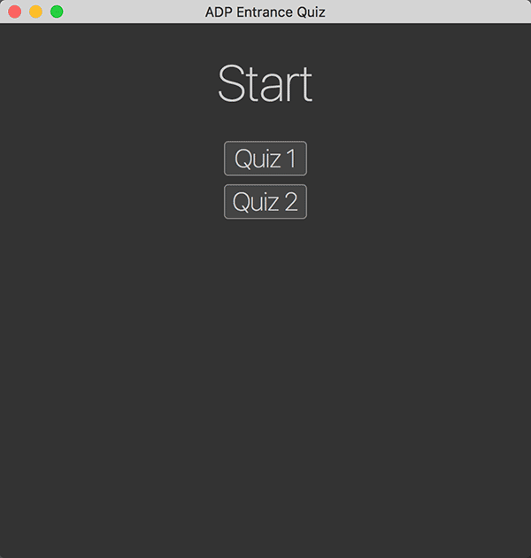

# App Developer Entrance Project

CA client-side quiz app based on the provided requirements, data and views.

## Screenshot (animated .gif)



## Installation / Setup

This project uses Express, and HTTP framework for Node.

You'll need Node.js. Then, to install the necessary node packages:
`npm install`

To start a localhost server:
`node quiz`

To stop the localhost server, use Ctrl C

## Quiz Data

Quiz data can be found in [public/src/quiz.json](.public/src/quiz.json). This content is loaded when a user starts a quiz.

For every question there is one correct answer (with a value of `true`) and three incorrect answers with a value of `false`. The `content` field contains a possible answer.

```js
{
  quizzes: [{
    title: 'Quiz 1',
    questions: [{
      question: 'Question 1?'
      answers: [{
        content: 'Answer 1.',
        value: false // wrong answer
      }, {
        content: 'Answer 2.',
        value: true // correct answer
      }]
    }]
  }]
}
```

## Functionality

All data displayed is pulled from the JSON in such a way that the that addational asnwers, questions, or even entire quizzes could be added to the JSON without needing to modify any scripts.